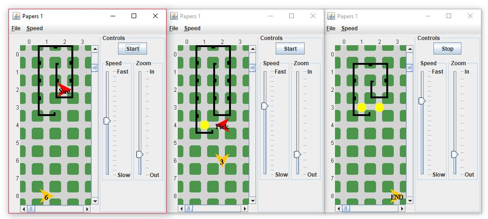

# Newspaper Delivery Bot
This project was coded on the Becker Robots platform that allows students to program a bot to move around, place objects, and navigate around different barriers. The program I have created allows a bot to deliver a newspaper to the front porch of a house while the homeowner comes out, picks it up, and goes back inside to read. I used threads to accomplish both these tasks simaltaneously. This program also accounts for houses of different shapes and sizes.

